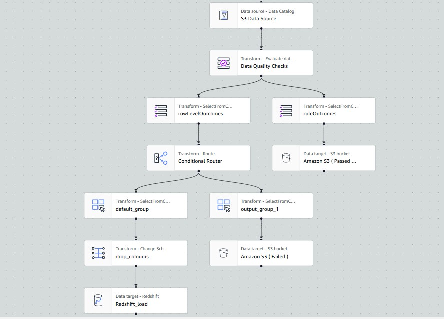

# movie-data-etl-pipeline
An end-to-end ETL pipeline for movie data using AWS Glue and Amazon Redshift, including data quality checks, transformations, and analysis of high-performance movies.

## Overview
This project involves processing movie data stored in Amazon S3, using AWS Glue for data cataloging, data quality checks, and ETL jobs, and loading the validated data into Amazon Redshift for analysis.

## Table of Contents
- [Getting Started](#getting-started)
- [Architecture](#architecture)
- [Implementation](#detailed-implementation-step)
- [Data Quality Checks](#data-quality-checks)
- [Resources: Datasets & script](#datasets-and-script)

## Getting Started
1. **Load Movie Data**: Upload the movie CSV data to Amazon S3 for scalable storage.
2. **Create Glue Catalog**: Establish a Glue database catalog and crawl the S3 data to create metadata.
3. **Establish Redshift Connection**: Set up a JDBC connection from AWS Glue to Amazon Redshift, ensuring the target table is crawled and available.
4. **Run Glue ETL Jobs**: Execute the Glue ETL jobs by running the provided PySpark script or by replicating the visual ETL workflow in Glue.
5. **Configure Networking**: Ensure proper networking setup by creating endpoints for CloudWatch and AWS Glue.
6. **Execute ETL Job**: Run the Glue ETL job to process the data and load it into the Redshift table. Subsequently, perform data analysis and create dashboards using Amazon QuickSight.

### Prerequisites
- AWS Account
- IAM roles with necessary permissions
- Python 3.12 (if using scripts)

### Setup
1. Clone the repository:
   ```bash
   git clone https://github.com/shahbaj-cse/movie-data-etl-pipeline.git

## Architecture


## Detailed Implementation Step

### 1. Load Movie Data
   - **Description**: Upload the imdb-movie CSV files containing relevant data (e.g., titles, ratings, genres) to an Amazon S3 bucket.
   - **Purpose**: This serves as the initial data storage layer, providing a scalable and durable location for raw data.

### 2. Create Glue Catalog
   - **Description**: Establish a Glue database catalog to manage metadata about the stored data. Use AWS Glue Crawlers to scan the S3 bucket and automatically generate the necessary tables in the Glue Data Catalog.
   - **Purpose**: This enables easier data discovery and access for subsequent processing and querying.

### 3. Establish Redshift Connection
   - **Description**: Configure a JDBC connection between AWS Glue and Amazon Redshift. Create a target table in Redshift to store the processed data and ensure it is crawled by Glue for metadata management.
   - **Purpose**: This connection facilitates seamless data transfer from Glue to Redshift, allowing for efficient data analytics.

### 4. Run Glue ETL Jobs
   - **Description**: Execute AWS Glue ETL jobs using a PySpark script or a visual ETL workflow created within the Glue console. This job transforms and processes the data based on defined rules and business logic.
   - **Purpose**: To ensure that the raw data is cleaned, transformed, and enriched before being loaded into the Redshift table.
     #### Visual ETL Jobs
     
     #### Data Quality Checks
        - During the Glue ETL jobs, we will implement a Data Quality (DQ) rule to ensure that only movies with ratings between 8.5 and 10 are considered high-performance and eligible for ingestion into Redshift.
        - Transformed data that meets this criterion will be loaded into the Redshift table, while any failed records will be stored in a designated S3 location for further review.
        - Regardless of the outcome, notifications will be sent via EventBridge to an SNS topic, which will in turn notify subscribers via email.


### 5. Configure Networking
   - **Description**: Set up the necessary networking configurations by creating endpoints for AWS Glue and Amazon CloudWatch. This ensures that Glue jobs can communicate effectively and that monitoring and logging are enabled.
   - **Purpose**: Proper networking configuration is critical for the reliability and observability of the data pipeline.

### 6. Execute ETL Job
   - **Description**: Run the Glue ETL job to process the data and load it into the Redshift table. After successful execution, use Amazon QuickSight for data analysis and visualization.
   - **Purpose**: This final step allows for in-depth analysis of the processed data, enabling the creation of insightful dashboards that can drive business decisions.

## Datasets and Script
  ### Dataset
  - [movies_data.csv](movie_data/imdb_movies_rating.csv): The dataset used for this project, containing movie information.
  
  ### Python Script
  - [Glue_ETL_Jobs.py](glue_etl_job_script.py): Python script for the ETL process in AWS Glue.
  
  ### Redshift Table for imdb data
  - [Redshift_Target_Table.txt](redshift_tables_for_imdb.txt): SQL script to create the target table in Redshift.
